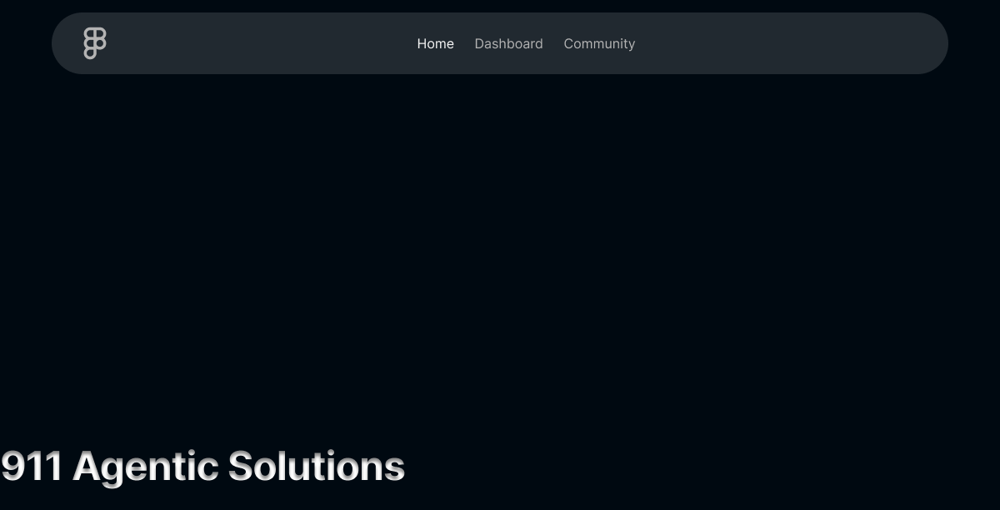

# SentinelAI: A Data Engineering Framework for Transforming Emergency Communications into Structured Incident Data

### Abstract

Emergency call systems (e.g., 911, 112) generate a continuous stream of critical but unstructured data, primarily in the form of audio and text transcripts. This valuable "data exhaust" is often ephemeral and not systematically processed, representing a significant missed opportunity for analytics, operational improvement, and machine learning. SentinelAI is a scalable, microservices-based data engineering platform designed to address this challenge. It implements a robust pipeline to ingest raw emergency communications, transform them into a standardized **Emergency Incident Data Object (EIDO)** JSON format, and intelligently correlate them into cohesive incident timelines. The primary objective is to create a durable, queryable, and high-fidelity dataset of public safety events, laying the groundwork for advanced research in emergency response, predictive analytics, and resource optimization.

---

## 1. System Architecture

SentinelAI is built on a distributed microservices architecture to ensure scalability, resilience, and maintainability. Each component is containerized using Docker and orchestrated via Docker Compose for local development or deployed as a unified application for cloud-native hosting (e.g., Fly.io).

#### 1.1. Architectural Diagram

*(Conceptual diagram inspiration)*

The diagram illustrates a decoupled system where a central **NGINX Reverse Proxy** acts as the single entry point. It intelligently routes traffic to the appropriate backend service based on the URL path. User-facing components like the **Landing Page** and **Dashboard** are served, while API requests are directed to the specialized Python-based microservices: the **EIDO Agent**, **IDX Agent**, and **Geocoding Agent**. All stateful, structured data is persisted in a central **PostgreSQL Database**, ensuring data integrity and durability.

#### 1.2. Core Services

*   **EIDO Agent**: The core data structuring engine. This service exposes an API to receive unstructured text (e.g., call transcripts). It leverages a Large Language Model (LLM) enhanced with a **Retrieval-Augmented Generation (RAG)** system. The RAG knowledge base is built directly from the EIDO OpenAPI schema, ensuring that the generated JSON is not only syntactically correct but also semantically aligned with the official standard.

*   **IDX Agent (Incident Correlation)**: This agent acts as the brain for incident management. It runs a continuous background process that fetches newly ingested, "uncategorized" EIDO reports. Using a hybrid approach of heuristic filters (geospatial proximity, temporal windows) and LLM-based semantic analysis, it determines whether a new report corresponds to an existing open incident or represents a new event.

*   **Geocoding Agent**: A specialized microservice dedicated to high-fidelity location extraction. It processes ambiguous, natural language location descriptions (e.g., "by the clocktower near the library") and converts them into precise latitude/longitude coordinates.

*   **Data Persistence Layer**: A central PostgreSQL database (`eido_db`) serves as the system's source of truth. It houses the structured and correlated data in `incidents` and `eido_reports` tables, making the once-transient information a permanent, analyzable asset.

*   **Dashboard & Ingestion Gateway**: A FastAPI-based web interface that provides a human-in-the-loop capability. Operators can use the dashboard to manually submit reports, monitor system status, view incident details, and manage system settings. It also acts as the primary API gateway, proxied by NGINX.

*   **Landing Page**: A static Next.js informational front page for the project.

## 2. The Data Engineering Pipeline

The flow of data through SentinelAI is designed as a multi-stage processing pipeline, transforming raw information into structured, actionable intelligence.

1.  **Ingestion**: Unstructured data, such as a 911 call transcript, is submitted to the system via the Dashboard UI or a direct API call. This creates an initial "uncategorized" EIDO report in the PostgreSQL database.

2.  **Structuring (EIDO Agent)**: The EIDO Agent's LLM, guided by its RAG system, parses the text. It performs named entity recognition (people, vehicles, locations), extracts key event details, and meticulously populates the fields of an EIDO JSON object according to the official schema.

3.  **Correlation (IDX Agent)**: The IDX Agent's categorizer routine detects the new, uncategorized report. It fetches all "open" incidents and calculates a similarity score based on:
    *   **Temporal Proximity**: Is the new report within a defined time window of an existing incident?
    *   **Geospatial Proximity**: Is the new report's location within a defined radius of an existing incident's known locations?
    *   **Semantic Similarity**: Does the description of the new report share significant semantic overlap with an existing incident's summary and associated reports?
    *   If a high-confidence match is found, the new EIDO report is linked to the existing incident. Otherwise, a new incident record is created.

4.  **Storage & Enrichment**: The now-structured and correlated data is persisted in the PostgreSQL database. The `eido_reports` record is updated from "uncategorized" to "linked," and its foreign key is set to the appropriate incident. The parent incident's `updated_at` timestamp is touched, and its summary or location data may be enriched with new information.

## 3. Key Innovations & Research Contributions

This project serves as a reference implementation for modern data engineering practices in the public safety domain.

*   **Schema-Enforced LLM Structuring with RAG**: The project demonstrates a novel and highly effective use of Retrieval-Augmented Generation where the knowledge base is a technical API schema (`openapi.yaml`). This forces the LLM to adhere to a complex, domain-specific data structure, significantly reducing validation errors, hallucinations, and improving overall data quality compared to simple prompt engineering. It represents a practical method for achieving reliable, structured data extraction in specialized domains.

*   **Hybrid Incident Correlation Engine**: The IDX Agent moves beyond simple rule-based systems. By combining fast, deterministic heuristic filters (geospatial/temporal) with sophisticated LLM-driven semantic decision-making, it creates a two-stage correlation process. This hybrid approach is both computationally efficient—as the LLM is only invoked for plausible candidates—and highly accurate, capable of discerning nuanced relationships between reports that traditional systems would miss.

*   **Creation of a Durable, Analyzable Dataset**: The primary output of this system is a structured, longitudinal dataset of emergency incidents. By transforming ephemeral call data into a persistent, queryable format, the platform creates an invaluable asset for academic research, operational analysis, and public policy. It enables studies on response effectiveness, resource allocation patterns, and the socio-temporal dynamics of public safety events.

## 4. Future Prospects & Research Directions

The SentinelAI platform is extensible and provides a foundation for numerous future research avenues:

*   **Real-time Audio Processing**: Integrate a live Speech-to-Text (STT) pipeline to process 911 audio streams directly, enabling near-real-time incident creation and analysis.

*   **Predictive Modeling**: Train machine learning models on the structured EIDO dataset to:
    *   Predict the required resources (e.g., number of police units, fire engines) based on the initial call description.
    *   Forecast incident escalation likelihood.
    *   Identify potential crime hotspots or traffic accident-prone areas.

*   **Anomaly Detection**: Develop algorithms to detect unusual patterns in incident data (e.g., a sudden spike in a specific incident type in a specific area) that could signify a larger, coordinated event or emerging threat.

*   **Natural Language Interaction**: Build a conversational AI layer on top of the database, allowing dispatchers or analysts to query the incident database using natural language (e.g., "Show me all active fire incidents in the downtown area from the last 3 hours").

## 5. Getting Started

The entire SentinelAI system is containerized for easy setup and deployment.

**Prerequisites:**
*   Docker & Docker Compose

**Steps:**
1.  **Clone the Repository**: `git clone <your-repository-url>` and `cd sentinelai`.
2.  **Configure Environment**: Copy `.env.example` to `.env` and fill in your API keys. For local development, the `DATABASE_URL` is already set correctly to use the Docker Compose database service.
3.  **Build and Run**: From the root `sentinelai` directory, run `docker-compose up --build -d`.
4.  **Access the System**:
    *   **Landing Page**: [http://localhost](http://localhost)
    *   **Dashboard**: [http://localhost/dashboard/](http://localhost/dashboard/)
    *   **API Docs**: Access EIDO, IDX, and Geocoding docs at `/api/eido/docs`, `/api/idx/docs`, and `/api/geo/docs` respectively.

## 6. Conclusion

SentinelAI successfully demonstrates the viability of a modern data engineering pipeline for public safety communications. By leveraging LLMs in a schema-constrained manner and combining them with heuristic systems, it transforms unstructured, transient data into a persistent, high-value asset. The platform not only solves the immediate problem of data structuring and correlation but also establishes a foundation for future AI-driven advancements in emergency response and management. The microservices architecture ensures that the system is scalable, maintainable, and ready for real-world deployment.
